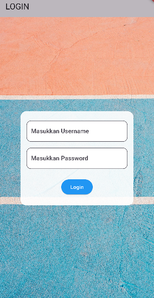
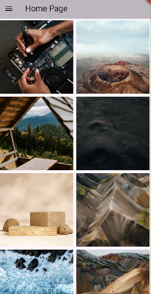
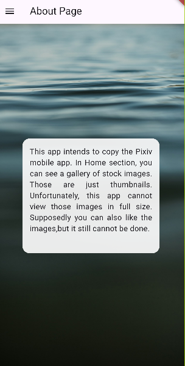

# Tugas Pertemuan 2

Nama : Rizky Budi Saputra

NIM : H1D022047

Shift Baru: F

## login_page.dart


```dart
body: Stack(
        children: [
          // Background Image
          SizedBox(
            height: double.infinity,
            width: double.infinity,
            child: FittedBox(
              fit: BoxFit.cover,
              child: Image.network(
                'https://images.unsplash.com/photo-1725714835781-5bd067b81a8c?q=80&w=1887&auto=format&fit=crop&ixlib=rb-4.0.3&ixid=M3wxMjA3fDB8MHxwaG90by1wYWdlfHx8fGVufDB8fHx8fA%3D%3D',
              ),
            ),
          ),
          // Container with TextField in the center
          Center(
            child: Container(
              padding: const EdgeInsets.all(16.0), // Padding for the Container
              width: 300, // Set width of the container
              height: 250, // Set height of the container
              decoration: BoxDecoration(
                color: Colors.white.withOpacity(0.9),
                borderRadius: BorderRadius.circular(16),

              ),
              child: Column(
                mainAxisAlignment: MainAxisAlignment.center,
                children: [
                  _showInput(_usernameController, 'Masukkan Username', false),
                  const SizedBox(height: 16),
                  _showInput(_passwordController, 'Masukkan Password', true),
                  const SizedBox(height: 24),
                  ElevatedButton(
                    style: ButtonStyle(
                      backgroundColor: MaterialStateProperty.all(Colors.blue.shade500),
                    ),
                    child: const Text('Login', style: TextStyle(color: Colors.white)),
                    onPressed: (){
                      if(_usernameController.text == 'admin' && _passwordController.text == 'admin'){
                        _saveUsername();
                        _showDialog('Anda Berhasil Login', const HomePage());
                      } else {
                        _showDialog('Username dan Password salah', const LoginPage());
                      }
                    },
                  )
                ],
              ),
            ),
          ),
        ],
      ),
```
Menggunakan Stack supaya 2 widget bisa bertumpuk. Hasilnya akan ada gambar latar belakang dengan container login di atasnya.
Gambar ada di dalam SizedBox yang memenuhi seluruh layar dan menggunakan link stock image.


## home_page.dart

```dart
final List<String> thumbnails = [
    'https://images.unsplash.com/photo-1721332150382-d4114ee27eff?w=500',
    'https://images.unsplash.com/photo-1727108718939-55cffc2cf873?w=500',
    'https://images.unsplash.com/photo-1726820254128-642495548079?q=80&w=1888&auto=format&fit=crop&ixlib=rb-4.0.3&ixid=M3wxMjA3fDB8MHxwaG90by1wYWdlfHx8fGVufDB8fHx8fA%3D%3D',
    'https://images.unsplash.com/photo-1726534168836-59dff8524925?w=500',
    'https://images.unsplash.com/photo-1726557116827-5f2a95d57cab?q=80&w=2070&auto=format&fit=crop&ixlib=rb-4.0.3&ixid=M3wxMjA3fDB8MHxwaG90by1wYWdlfHx8fGVufDB8fHx8fA%3D%3D',
    'https://images.unsplash.com/photo-1726533870778-8be51bf99bb1?q=80&w=1974&auto=format&fit=crop&ixlib=rb-4.0.3&ixid=M3wxMjA3fDB8MHxwaG90by1wYWdlfHx8fGVufDB8fHx8fA%3D%3D',
    'https://images.unsplash.com/photo-1727306913165-b053fdf96248?q=80&w=1933&auto=format&fit=crop&ixlib=rb-4.0.3&ixid=M3wxMjA3fDB8MHxwaG90by1wYWdlfHx8fGVufDB8fHx8fA%3D%3D',
    'https://images.unsplash.com/photo-1727229766396-efc10f50c169?q=80&w=1998&auto=format&fit=crop&ixlib=rb-4.0.3&ixid=M3wxMjA3fDB8MHxwaG90by1wYWdlfHx8fGVufDB8fHx8fA%3D%3D',
    'https://images.unsplash.com/photo-1727190887587-af08ece60d3d?q=80&w=2069&auto=format&fit=crop&ixlib=rb-4.0.3&ixid=M3wxMjA3fDB8MHxwaG90by1wYWdlfHx8fGVufDB8fHx8fA%3D%3D',
    'https://images.unsplash.com/photo-1727108106361-a822fcbcdeed?q=80&w=1906&auto=format&fit=crop&ixlib=rb-4.0.3&ixid=M3wxMjA3fDB8MHxwaG90by1wYWdlfHx8fGVufDB8fHx8fA%3D%3D',
  ];

class ImageRow extends StatelessWidget {
  final double imageWidth;
  final String firstImage;
  final String secondImage;

  const ImageRow({
    Key? key,
    required this.imageWidth,
    required this.firstImage,
    required this.secondImage,
  }) : super(key: key);

  @override
  Widget build(BuildContext context) {
    return Row(
      children: [
        Expanded(
          child: Padding(
            padding: const EdgeInsets.all(4.0),
            child: Container(
              width: imageWidth - 8,
              height: imageWidth - 8,
              decoration: BoxDecoration(
                color: Colors.white,
                image: DecorationImage(
                  image: NetworkImage(firstImage),
                  fit: BoxFit.cover,
                ),
              ),
            ),
          ),
        ),
        Expanded(
          child: Padding(
            padding: const EdgeInsets.all(4.0),
            child: Container(
              width: imageWidth - 8,
              height: imageWidth - 8,
              decoration: BoxDecoration(
                color: Colors.white,
                image: DecorationImage(
                  image: NetworkImage(secondImage),
                  fit: BoxFit.cover,
                ),
              ),
            ),
          ),
        ),
      ],
    );
```
Membuat widget Row custom yang berisi 2 gambar thumbnail. Memiliki parameter imageWidth untuk menentukan lebar gambar, 
firstImage untuk link gambar kedua dan secondImage untuk gambar kedua. Gambar diambil dari thumbnails.

```dart
body: SingleChildScrollView(
        child: Column(
          children: [
            ImageRow(imageWidth: imageWidth, firstImage: thumbnails[0], secondImage: thumbnails[1]),
            ImageRow(imageWidth: imageWidth, firstImage: thumbnails[2], secondImage: thumbnails[3]),
            ImageRow(imageWidth: imageWidth, firstImage: thumbnails[4], secondImage: thumbnails[5]),
            ImageRow(imageWidth: imageWidth, firstImage: thumbnails[6], secondImage: thumbnails[7]),
            ImageRow(imageWidth: imageWidth, firstImage: thumbnails[8], secondImage: thumbnails[9]),
          ],
        ),
      ),
```
Penggunan dari widget ImageRow buatan.

## about_page.dart

Hanya berisi visi sesungguhnya dari aplikasi


